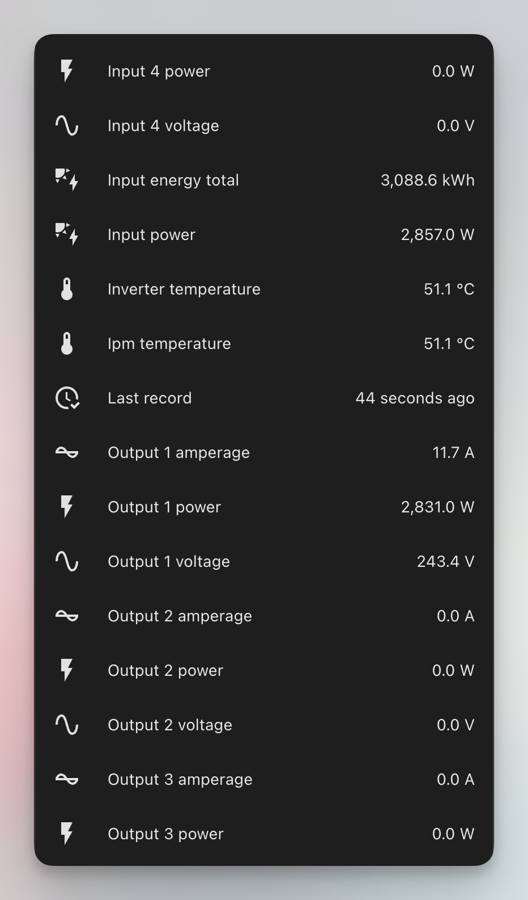
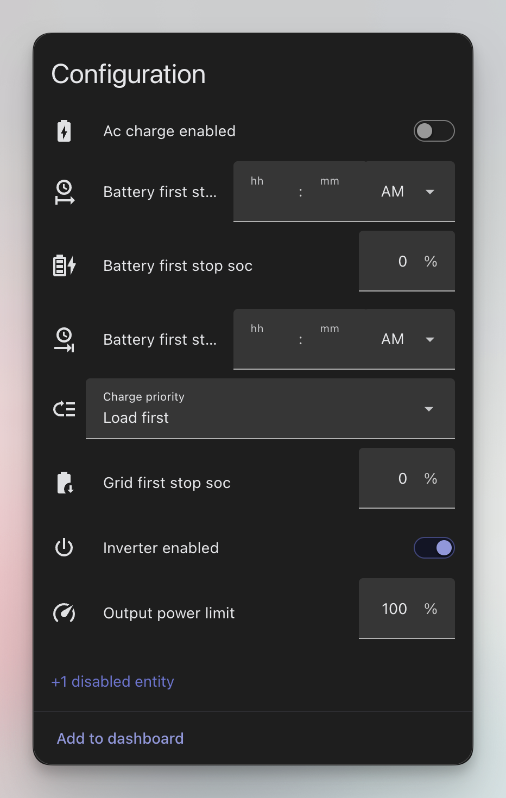

<p align="center">
  
</p>

<h1 align="center">Growatt Datalogger</h1>

<p align="center">
  Your solar data in Home Assistant, straight from the inverter.<br>
  No cloud account, no MQTT broker, no add-on, no Docker.
</p>

<p align="center">
  <a href="https://my.home-assistant.io/redirect/hacs_repository/?owner=FezVrasta&repository=growatt-datalogger&category=integration">
    
  </a>
</p>

---

Your Growatt datalogger normally uploads to Growatt's servers. This integration **is** a
server: you point the datalogger at Home Assistant, and it uploads there instead.

Everything stays on your network, and it keeps working when your internet doesn't.

## What you get

A device for your datalogger and one for each inverter behind it, with sensors for
everything the inverter reports — PV strings, grid voltage and current, temperatures, and
energy counters. Settings the inverter accepts become controls you can change.

<table>
  <tr>
    <td width="50%"></td>
    <td width="50%"></td>
  </tr>
  <tr>
    <td align="center"><em>What the inverter reports</em></td>
    <td align="center"><em>What you can change</em></td>
  </tr>
</table>

Sensors appear as the inverter reports them, so there is no list to configure and nothing
to map by hand.

Energy counters are classified so the **Energy Dashboard** works without templates or
helpers. Just add the inverter under solar production.

Sensors **keep their last reading overnight** rather than going unavailable. Inverters
stop reporting after sunset, and blanking every entity would put a gap in every history
graph, every night. If you want to know whether data is still arriving, use the
**Last record** sensor or the **Connected** binary sensor.

**Connected** means "still sending", not "socket open". A datalogger dials in, uploads and
hangs up every couple of minutes, so a sensor that followed the connection would flap all
day on perfectly healthy hardware. It turns off after 15 minutes of silence instead, which
makes it safe to alert on directly.

You also get a **Sync time** button and services for reading or writing any register
directly.

## Install

1. Open it in HACS, download it, and restart Home Assistant.

   [](https://my.home-assistant.io/redirect/hacs_repository/?owner=FezVrasta&repository=growatt-datalogger&category=integration)

   Or add `https://github.com/FezVrasta/growatt-datalogger` as a custom repository by
   hand, with category **Integration**.

2. Add the integration. The only question is the port — leave it at 5279.

   [](https://my.home-assistant.io/redirect/config_flow_start/?domain=growatt_datalogger)
3. Point your datalogger at Home Assistant:

   **ShineLan / ShineLan-X** — open the datalogger's IP address in a browser and go to
   the network settings. Turn **domain-name resolution off**, set the server IP to your
   Home Assistant machine, and the port to 5279. Then reboot the datalogger — without
   that it keeps talking to the old server and nothing arrives.

   **ShineWiFi-X / ShineWiFi-S** — in the ShinePhone app go to **Me → Datalogger
   configuration**, put the stick into hotspot mode, connect your phone to it, then in
   the advanced server settings turn off domain-name mode and set the IP and port.

4. Wait for the next upload. A minute for most dataloggers, longer for some. The devices
   and sensors appear on their own.

To undo it all, set the datalogger's server back to `server.growatt.com`.

> **Note:** by default your inverter stops reporting to Growatt, so ShinePhone and
> ShineServer stop updating. If you want both, see below.

## Keeping ShinePhone working

Turn on **Also forward to the Growatt cloud** in the integration's options. Home Assistant
then passes everything through to Growatt as well as reading it.

If Growatt becomes unreachable, Home Assistant takes over answering the datalogger
immediately, so a cloud outage never costs you data.

## Options

Under **Settings → Devices & services → Growatt Datalogger → Configure**.

| Option | Default | What it does |
|---|---|---|
| Also forward to the Growatt cloud | off | Keeps ShinePhone and ShineServer working. |
| Historical records | Fire an event | What to do with the backlog a datalogger replays after an outage. |
| Expose unrecognised registers | off | Adds a disabled diagnostic sensor for every register the integration cannot name. Useful when adding support for a new model; noise otherwise. |

**Historical records** need a word of explanation. After an outage your datalogger replays
what it buffered, but those readings carry a *past* timestamp — writing them to live
sensors would invent power spikes and corrupt your statistics. So they are never merged
with live data. By default they fire a `growatt_datalogger_buffered_record` event an
automation can pick up; the alternative is to discard them.

## Changing inverter settings

Settings whose meaning Growatt actually documents get real entities, under Configuration
on the inverter device — the output power limit, and on a hybrid the charge priority, SOC
limits and charge windows.

A lot of what circulates about *other* registers is community folklore: right on one
person's firmware, wrong on another's. Those entities exist but are created disabled, and
each one shows where its meaning came from in its attributes.

For anything else, there are services:

```yaml
action: growatt_datalogger.read_register
data:
  device_id: <your inverter>
  register: 45
```

```yaml
action: growatt_datalogger.write_register
data:
  device_id: <your inverter>
  register: 3
  value: 80
  confirm: true
```

`confirm` is a deliberate speed bump — writing the wrong holding register on a grid-tied
inverter can change how it behaves on the grid. Use `write_registers` when a value spans
more than one register, so they change together.

## Troubleshooting

**No data at all.** Check the datalogger really was rebooted after you changed its server
setting, and that nothing else on the machine is using port 5279. The **Connected** binary
sensor tells you whether the datalogger has reached Home Assistant at all.

**Values look wrong, or your model isn't decoded.** A packet capture is what makes that
fixable:

```sh
python tools/capture.py --out session.jsonl
```

Point the datalogger at the machine running that instead of at Home Assistant; it forwards
to Growatt as normal while recording. **Serial numbers are replaced before anything is
written**, so the capture can go in an issue without publishing your hardware identifiers,
and it still decodes.

## For developers

The protocol itself is a separate, dependency-free package —
[**growatt-protocol**](packages/growatt-protocol) — usable on its own, with or without
Home Assistant:

```sh
pip install growatt-protocol
```

- [Architecture and development](docs/ARCHITECTURE.md) — how records are decoded, how the
  repository is laid out, how to run the tests and cut a release
- [Provenance](PROVENANCE.md) — where every part came from, and under which license

## License

MIT, except the register definitions inside `growatt-protocol`, which are Apache-2.0 and
derived from
[Homeassistant-Growatt-Local-Modbus](https://github.com/WouterTuinstra/Homeassistant-Growatt-Local-Modbus).
See [NOTICE](NOTICE).

This project is **not** derived from `johanmeijer/grott`, which carries no license.
